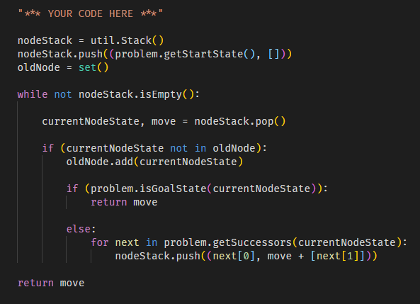
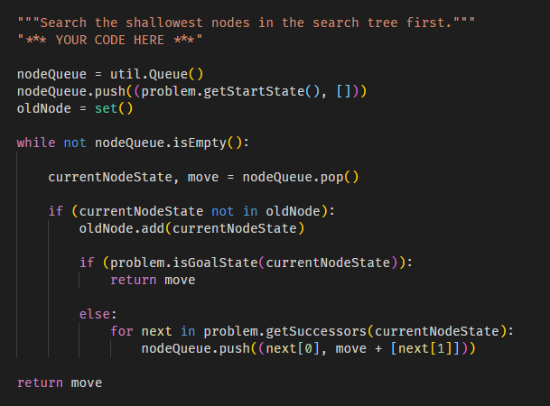
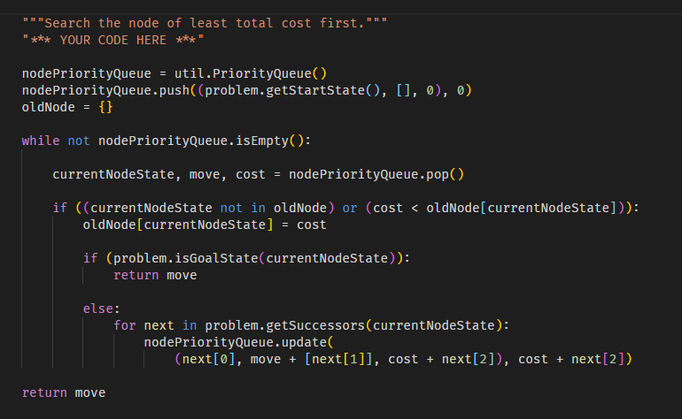
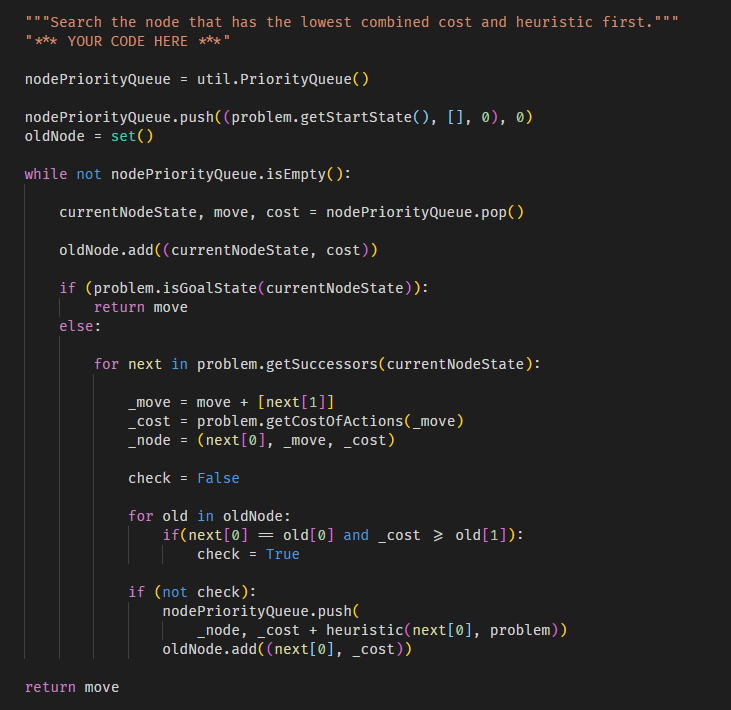
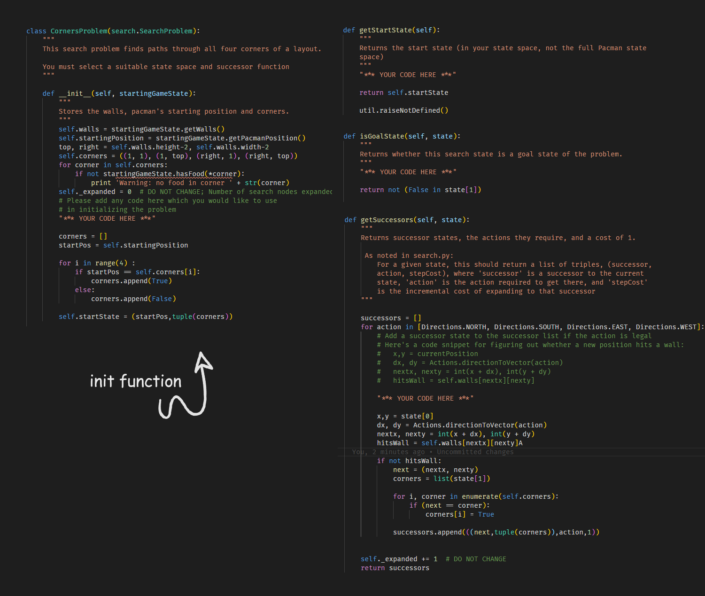
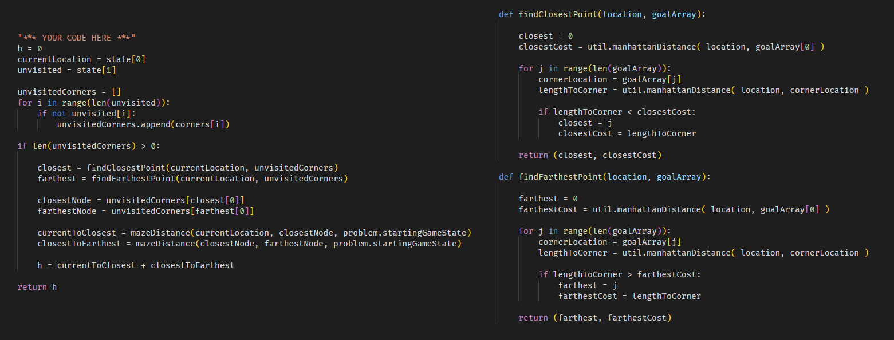
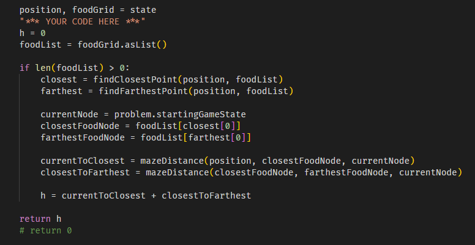
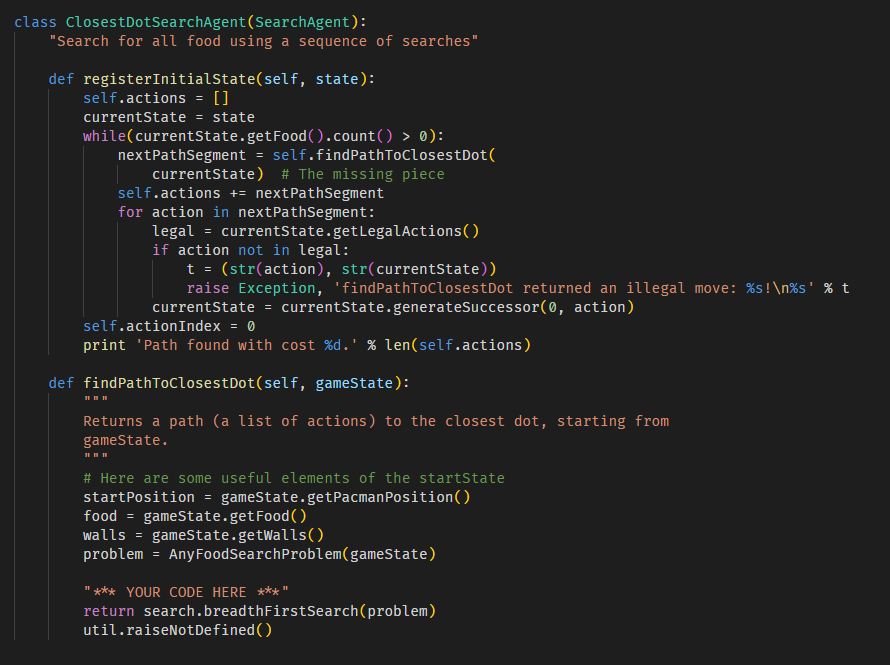

# **[AI RESEARCHING] PACMAN PROJECT - SEARCH**

## **[18020916 | K63J] - [Phan Van Minh]

![Question 1]

### **Normal Game**

```python
python pacman.py
```

### [**Question 1️⃣ ( depthFirstSearch )

```python
python pacman.py -l tinyMaze -p SearchAgent
```

```python
python pacman.py -l mediumMaze -p SearchAgent
```

```python
python pacman.py -l bigMaze -z .5 -p SearchAgent
```

#### Mô tả :



`nodeStack` - ngăn xếp dùng để chứa các node trong quá trình duyệt DFS.

`oldNode` - 1 set lưu trữ các node đã duyệt qua

`currentNodeState` - trạng thái, state của node hiện tại đang duyệt tới

`move` - các bước đi (actions) từ vị trí ban đầu tới node hiện tại

👉 Duyệt DFS cho đến khi `nodeStack` không còn phần tử nào hoặc khi đạt được tới `goalState`

### [**Question 2️⃣ ( breadthFirstSearch )**]

```python
python pacman.py -l mediumMaze -p SearchAgent -a fn=bfs
```

```python
python pacman.py -l bigMaze -p SearchAgent -a fn=bfs -z .5
```

```python
python eightpuzzle.py
```

#### Mô tả :



👉 Tương tự `Question 1` nhưng thay vì sử dụng `Stack` thì ta sử dụng `Queue` để duyệt BFS

### [**Question 3️⃣ ( uniformCostSearch )**]

```python
python pacman.py -l mediumMaze -p SearchAgent -a fn=ucs
```

```python
python pacman.py -l mediumDottedMaze -p StayEastSearchAgent
```

```python
python pacman.py -l mediumScaryMaze -p StayWestSearchAgent
```

#### Mô tả :



👉 Thay vì sử dụng Queue thông thường, ta sử dụng PriorityQueue (hàng đợi ưu tiên) để duyệt UCS. Các node có mức độ ưu tiên cao hơn (chi phí thấp hơn) sẽ được duyệt trước.

👉 `oldNode` sử dụng kiểu `dict` thay vì `set` như các câu hỏi trước

👉 Trong quá trình duyệt các node, nếu phát hiện ra chi phí thấp hơn để tới `currentNodeState` thì tiến hành gán lại chi phí cho `currentNodeState` trong `oldNode`

👉 Duyệt `UCS` cho đến khi `nodePriorityQueue` không còn phần tử nào hoặc khi đạt được tới `goalState`

### [**Question 4️⃣ ( A\* search )**]

```python
python pacman.py -l bigMaze -z .5 -p SearchAgent -a fn=astar,heuristic=manhattanHeuristic
```

#### Mô tả :



👉 Sử dụng `Priority Queue` tương tự Question 3.

👉 Thay đổi công thức tính độ ưu tiên của từng node trong `Priority Queue` theo công thức `F = G + H`

### [**Question 5️⃣ ( CornersProblem )**]

```python
python pacman.py -l tinyCorners -p SearchAgent -a fn=bfs,prob=CornersProblem
```

```python
python pacman.py -l mediumCorners -p SearchAgent -a fn=bfs,prob=CornersProblem
```

#### Mô tả :



👉 Tại hàm init ta lưu lại trạng thái bắt đầu của Pacman, có thể lấy bằng hàm `getStartState(...)`.
Kiểm tra Pacman khi bắt đầu đã nằm ở bất kỳ góc nào hay chưa.

👉 `isGoalState(...)` kiểm tra Pacman đã tới tất cả các góc hay chưa và trả về True/False

👉 `getSuccessors(...)` kiểm tra các hướng (xem có tường hay không), cập nhật trạng thái và trả về các `successors` có thể đi được.

👉 Sử dụng các thuật toán tìm kiếm đã làm ở các Question trên để giải quyết bài toán

### [**Question 6️⃣ ( Corners Problem: Heuristic )**]

```python
python pacman.py -l mediumCorners -p AStarCornersAgent -z 0.5
```

#### Mô tả :



### [**Question 7️⃣ ( Eating All The Dots )**]

```python
python pacman.py -l testSearch -p AStarFoodSearchAgent
```

#### Mô tả :



### [**Question 8️⃣ ( Suboptimal Search )**]

```python
python pacman.py -l bigSearch -p ClosestDotSearchAgent -z .5
```

#### Mô tả :


